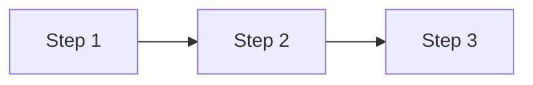

# /plan Workflow

> Quick planning workflow for tasks/features with 4 phases. Use when you need to move fast while still having a clear plan.

## 🎯 When to Use?

| Scenario | Use `/plan`? | Note |
|----------|--------------|------|
| Small/medium task, need speed | ✅ Yes | Lightweight, 1 file |
| Complex new feature | ✅ Yes | Can convert to full docs later |
| Bug fix with analysis | ❌ No | Use `/fix-bug` |
| Only need docs | ❌ No | Use `/gen-feature-doc` |

---

## 📁 Output Structure

```
docs/
└── plans/                    # Quick plans (from /plan)
    ├── add-2fa.md
    └── refactor-auth.md
```

---

## 📊 Task Status Convention

| Status | Symbol | Description |
|--------|--------|-------------|
| Waiting | `- [ ]` | Not started |
| In Progress | `- [/]` | Currently working |
| Done | `- [x]` | Completed |

---

## ⚡ Core Principle: Auto-Continue

> **DEFAULT**: If requirements are clear and no decision is needed → **automatically continue** to the next phase without asking user.
> **EXCEPTION**: Always stop and ask user before Phase 4 (Implementation).

Only stop and ask user when:
- Requirements are unclear/ambiguous
- Design decisions need user input
- Multiple valid approaches exist and preference matters
- **Phase 3 → Phase 4 transition** (always ask before implementing)

---

## 🔄 Workflow Phases

### Phase 1: Requirements

**INPUT**: User describes task/feature

**ACTIONS**:
1. Parse user input to extract:
   - Task name (kebab-case)
   - Main requirements
   - Scope (in/out)
2. Search codebase to understand context
3. Generate requirements section

**DECISION POINT**:

| Situation | Action |
|-----------|--------|
| **Requirements CLEAR** | ✅ Auto-continue to Phase 2 |
| **Requirements UNCLEAR** | ⚠️ Ask user with simple survey |

**Survey Format (if needed)**:
```
❓ Need clarification:

1. [Question 1]?
   - A: [description] ← Recommended
   - B: [description]

2. [Question 2]?
   - A: [description]
   - B: [description] ← Recommended

Reply with: "1A, 2B" or describe in detail.
```

**OUTPUT**: Requirements list, scope definition

---

### Phase 2: Design & Review

**ACTIONS**:
1. Determine approach/solution
2. List files to create/modify
3. Create simple diagram (if needed)
4. Identify potential issues/decisions

**DECISION POINT**:

| Situation | Action |
|-----------|--------|
| **No issues/decisions needed** | ✅ Skip review, auto-continue → **Create Plan File immediately** |
| **Has issues needing confirmation** | ⚠️ Ask user with options + recommendation → **Create Plan File after confirmation** |

**Confirmation Format (if needed)**:
```
⚠️ Need design decisions:

1. [Issue 1]
   - A: [description] ← Recommended
   - B: [description]
   - Why A: [reason]

2. [Issue 2]
   - A: [description]
   - B: [description] ← Recommended
   - Why B: [reason]

Reply: "1A, 2B" or "all recommended"
```

**IMMEDIATELY AFTER REVIEW (or skip)**:
1. Ensure directory exists: `mkdir -p docs/plans`
2. Create plan file: `docs/plans/[plan-name].md`

**OUTPUT**: Design decisions, files to modify, **Plan file created**

---

### Phase 3: Task Breakdown

**PREREQUISITE**: Plan file already exists from Phase 2

**ACTIONS**:
1. Break down design into specific tasks
2. Estimate complexity of each task
3. Determine execution order (dependencies)
4. **Register tasks via CLI** — assign priorities to enforce order (p1 = highest priority):
   ```bash
   j t list -P plan/[name]                       # Check no duplicates
   j t add "<task>" -p <pri> -P plan/[name]       # Add each task with priority
   j t dep <child> <parent>                       # Set dependencies
   ```
5. Update plan file with reference: `> 📋 Tasks: \`j t list -P plan/[name]\``
6. **Sync tasks to git**: `j t sync`

> 📖 Reference: `j t guide` for full usage
> ℹ️ `j t ready` returns tasks sorted by priority (p1 = highest). `j t pick` picks the highest-priority ready task.

**Task Breakdown Rules**:
- Each task should complete in 5-15 minutes
- Tasks must be atomic (can commit separately)
- Include related file for each task
- Assign priority: lower number = higher priority (dependencies first, then core, then tests)

**OUTPUT**: Tasks registered via CLI

---

### Phase 3.5: Ask User Before Implementation

> **MANDATORY**: Always stop here and ask user before proceeding to implementation.

**OUTPUT**:
```
📋 Planning phase completed!

📄 Plan: docs/plans/[plan-name].md
📊 Tasks registered: `j t list -P plan/[name]`
📊 Ready to implement: `j t ready -P plan/[name]`
   (sorted by priority — highest priority first)

👉 Bạn muốn tiếp tục implement không? (yes/no)
```

**WAIT** for user response.

- **If yes** → Continue to Phase 4
- **If no** → Stop. User can resume later with `/plan [name]`

---

### Phase 4: Implementation

**ACTIONS**:
1. Get ready tasks (sorted by priority): `j t ready -P plan/[name]`
2. For each task:
   - Pick (auto-picks highest-priority ready task): `j t pick`
   - Implement the task
   - Complete: `j t done <id>`
3. When all complete: `j t list -P plan/[name]` → all ✅

**OUTPUT**:
```
✅ Plan Completed: [plan-name]

📄 Plan: docs/plans/[plan-name].md
📦 Files Changed: [list]
📊 Tasks: j t summary

Next: Review changes and commit with /commit-it
```

---

## 📝 Plan File Template

> **Note**: Always run `mkdir -p docs/plans` before creating plan file

```markdown
# Plan: [Task Name]

> **Status**: 🟡 DRAFT | 🟢 IN_PROGRESS | ✅ COMPLETED
> **Created**: [YYYY-MM-DD]
> **Updated**: [YYYY-MM-DD]

## 📋 Requirements

- [Requirement 1]
- [Requirement 2]
- [Requirement 3]

## 🎯 Scope

**In Scope**:
- [item 1]
- [item 2]

**Out of Scope**:
- [item 1]

## 📐 Design

### Approach
[Brief description of the solution approach]

### Files to Create/Modify

| File | Action | Description |
|------|--------|-------------|
| `src/path/file.ts` | CREATE | [what this file does] |
| `src/path/existing.ts` | MODIFY | [what changes] |

### [OPTIONAL] Flow Diagram



## ✅ Task Breakdown

### Phase: Setup
- [ ] Task 1: [description] (`file.ts`)
- [ ] Task 2: [description] (`file.ts`)

### Phase: Core Implementation
- [ ] Task 3: [description] (`file.ts`)
- [ ] Task 4: [description] (`file.ts`)

### Phase: Testing & Cleanup
- [ ] Task 5: Test implementation
- [ ] Task 6: Update related docs if needed

## 📝 Decisions Made

| Decision | Choice | Reason |
|----------|--------|--------|
| [Decision 1] | [Option chosen] | [Why] |

## 📝 Notes

[Any additional notes, decisions, or considerations]

---

## 🔗 Related

- **Feature docs**: [link if exists]
- **Related plans**: [link if exists]
```

---

## ⚠️ Critical Rules

1. ✅ **Auto-continue when clear** - Only ask user when truly necessary
2. ✅ **Always ask before implementation** - Mandatory user confirmation between Phase 3 and Phase 4
3. ✅ **Always provide recommendation** - When asking, always suggest best option
4. ✅ **Create plan file immediately after review** - Don't wait until Phase 3
5. ✅ **Ensure directory exists** - Always run `mkdir -p docs/plans` before creating plan file
6. ✅ **Checkpoint after each task** - Update checkbox: `[ ]` → `[/]` → `[x]`
7. ✅ **Keep it simple** - Plan should be readable in 2-3 minutes
8. ✅ **Verify from code** - All design decisions must be based on actual codebase
9. ✅ **Priority order** - `j t ready` returns tasks sorted by priority (p1 highest). `j t pick` picks highest-priority ready task.

---

## 🔀 Convert to Feature (Optional)

If later you need full FRD/TDD documentation:

```bash
# Manually convert plan to feature docs
/gen-feature-doc "Convert plan [plan-name] to full feature documentation"
```

Workflow will read plan file and generate full FRD/TDD from it.

---

## 📋 Examples

### Example 1: Simple Task (Auto-continue, stop before implement)
```
User: /plan Add logout button to navbar

Phase 1 (Requirements): ✅ Clear → auto-continue
Phase 2 (Design): ✅ No issues → skip review
  → mkdir -p docs/plans
  → Create docs/plans/add-logout-button.md ← Plan file created immediately!
Phase 3 (Task Breakdown): ✅ Tasks registered via CLI
Phase 3.5 (Ask User): ⚠️ STOP

📋 Planning phase completed!
📄 Plan: docs/plans/add-logout-button.md
📊 Ready to implement: `j t ready -P plan/add-logout-button`

👉 Bạn muốn tiếp tục implement không? (yes/no)

User: "yes"

Phase 4 (Implementation):
- j t pick → Task 1 (highest priority)
- [/] Add LogoutButton component ← in progress
- [ ] Add onClick handler
- [ ] Test logout flow
```

### Example 2: Task with Requirements Clarification
```
User: /plan Add user notification

Phase 1 (Requirements): ⚠️ Needs clarification

❓ Need clarification:
1. Notification type?
   - A: Toast/Snackbar (quick messages) ← Recommended
   - B: Push notification (browser)
   - C: Email notification

2. Trigger when?
   - A: After specific actions ← Recommended
   - B: Real-time from server

User: "1A, 2A"

Phase 2 (Design): ✅ No issues → skip review
  → mkdir -p docs/plans
  → Create docs/plans/add-user-notification.md ← Plan file created!
Phase 3: ✅ Tasks registered
Phase 3.5: ⚠️ Ask user → "yes" → Phase 4 starts...
```

### Example 3: Task with Design Decision
```
User: /plan Implement caching for API

Phase 1: ✅ Clear → auto-continue

Phase 2: ⚠️ Needs design decision

⚠️ Need design decisions:
1. Cache strategy?
   - A: In-memory (simple, clears on restart)
   - B: Redis (persistent, shared) ← Recommended
   - Why B: Team already has Redis setup

User: "B" or "all recommended"

  → mkdir -p docs/plans
  → Create docs/plans/implement-api-caching.md ← Plan file created after confirmation!

Phase 3: ✅ Tasks registered
Phase 3.5: ⚠️ Ask user → "yes" → Phase 4 starts...
```

### Example 4: Complex Task (Needs Review at Phase 3)
```
User: /plan Refactor authentication to support SSO

Phase 1: ✅ Clear
Phase 2: ✅ No issues
  → mkdir -p docs/plans
  → Create docs/plans/refactor-auth-sso.md ← Plan file created!

Phase 3: ⚠️ Complex change, show summary

📋 Plan Updated: docs/plans/refactor-auth-sso.md

📊 Summary:
- Tasks: 12 tasks
- Files: 8 files to create/modify
- Estimated: 60 minutes
- Risk: HIGH (affects authentication)

Phase 3.5: ⚠️ STOP - Ask user before implementation

📋 Planning phase completed!
📊 Ready to implement: `j t ready -P plan/refactor-auth-sso`

👉 Bạn muốn tiếp tục implement không? (yes/no)

User: "yes"

Phase 4: Implementation starts...
  → j t pick (highest-priority ready task)
```
