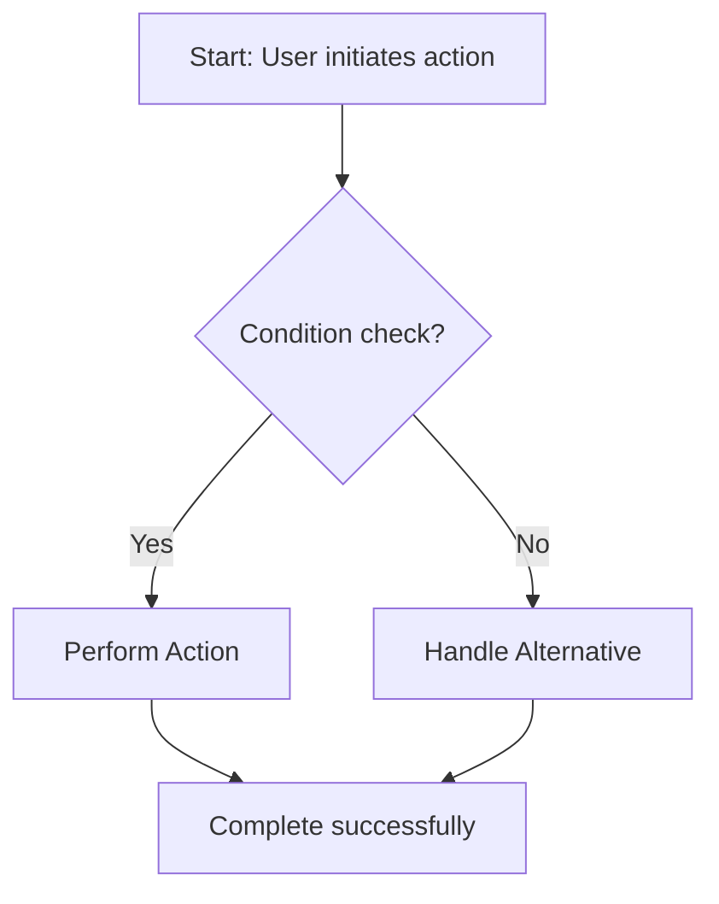

# FRD: [Feature Name]

> **Feature**: [Name] | **Priority**: High/Medium/Low | **Status**: Draft/Review/Approved
> **Version**: 1.0 | **Updated**: [YYYY-MM-DD]

---

## 1. Tổng quan (Overview) [REQUIRED]

| Item | Mô tả |
|------|-------|
| **Mục đích (Purpose)** | [Business value - why this feature exists] |
| **Phạm vi (Scope)** | Bao gồm: [...] \| Không bao gồm: [...] |
| **Người dùng (Users)** | [Roles that use this feature] |
| **Dependencies** | [Features/Systems required before this] |

---

## 2. User Stories [REQUIRED]

### US-001: [Story Title]

**As** [role], **I want** [action], **so that** [benefit].

**Acceptance Criteria**:
- [ ] AC-001: Given [context], when [action], then [result]
- [ ] AC-002: Given [context], when [action], then [result]

| Attribute | Value |
|-----------|-------|
| Priority | High/Medium/Low |

---

## 3. Business Rules [CONDITIONAL]

> **INCLUDE IF**: Feature có business rules phức tạp (validation, calculation, workflow logic)
> **SKIP IF**: Simple CRUD without special rules

| ID | Rule Name | Description | Exception |
|----|-----------|-------------|-----------|
| BR-001 | [Rule name] | When [condition], then [action] | [If any] |
| BR-002 | [Rule name] | [Description] | None |

---

## 4. Non-Functional Requirements [CONDITIONAL]

> **INCLUDE IF**: Feature có yêu cầu đặc biệt về performance, security, accessibility
> **SKIP IF**: Standard requirements, no special metrics needed

| ID | Category | Requirement | Metric | Priority |
|----|----------|-------------|--------|----------|
| NFR-001 | Performance | [Requirement] | [e.g., < 200ms response] | High |
| NFR-002 | Security | [Requirement] | [e.g., encrypt PII] | High |

---

## 5. Process Flow [CONDITIONAL]

> **INCLUDE IF**: Multi-step process or complex user journey
> **SKIP IF**: Single-step action or simple CRUD

---

## 6. Transition Requirements [CONDITIONAL]

> **INCLUDE IF**: Có migration từ hệ thống/data cũ
> **SKIP IF**: New feature, no existing data to migrate

| ID | Current State | Target State | Migration Steps |
|----|---------------|--------------|-----------------|
| TR-001 | [Current] | [Target] | [Steps] |

---

## References

| Type | Path/Link |
|------|-----------|
| TDD | `docs/features/[feature]/TDD-[feature].md` |
| Test Scenarios | `docs/features/[feature]/test-scenarios.md` |
