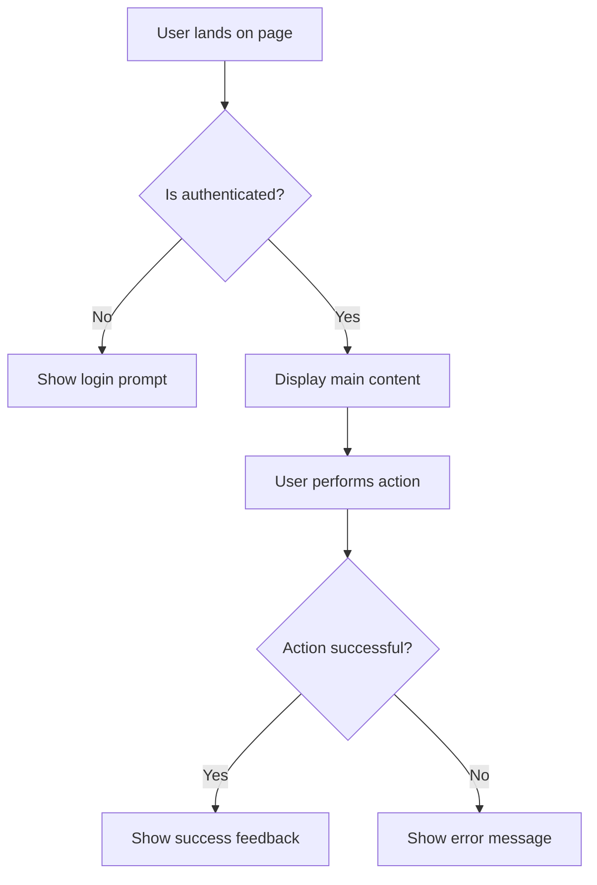

# FRD: [Feature Name] (Frontend)

> **Feature**: [Name] | **Priority**: High/Medium/Low | **Status**: Draft/Review/Approved
> **Platform**: Web/Mobile/Desktop | **Version**: 1.0 | **Updated**: [YYYY-MM-DD]

---

## 1. Tổng quan (Overview) [REQUIRED]

| Item | Mô tả |
|------|-------|
| **Mục đích (Purpose)** | [User value - what users can accomplish with this UI] |
| **Phạm vi (Scope)** | Bao gồm: [...] \| Không bao gồm: [...] |
| **Người dùng (Users)** | [User roles interacting with this UI] |
| **Pages/Routes** | `/[page-path]`, `/[page-path-2]` |
| **Dependencies** | [Features/Screens required before this] |

---

## 2. User Stories [REQUIRED]

### US-001: [Story Title]

**As** [role], **I want** [UI action], **so that** [benefit].

**Acceptance Criteria**:
- [ ] AC-001: Given [UI state], when [user action], then [visual result]
- [ ] AC-002: Given [UI state], when [user action], then [visual result]

| Attribute | Value |
|-----------|-------|
| Priority | High/Medium/Low |

---

## 3. UI Behavior Rules [CONDITIONAL]

> **INCLUDE IF**: Feature có UI interactions phức tạp, conditional rendering
> **SKIP IF**: Simple display-only UI without complex interactions

| ID | Rule Name | Trigger | Behavior |
|----|-----------|---------|----------|
| UB-001 | [Rule name] | When user [action] | UI should [behavior] |
| UB-002 | [Rule name] | When [condition] | [Visual feedback] |

---

## 4. User Flow (UX Journey) [CONDITIONAL]

> **INCLUDE IF**: Multi-step user journey or complex navigation flow
> **SKIP IF**: Single-page action, simple form submission

---

## 5. Non-Functional Requirements [CONDITIONAL]

> **INCLUDE IF**: Có yêu cầu đặc biệt về performance, accessibility, responsive
> **SKIP IF**: Standard web requirements apply

| ID | Category | Requirement | Metric |
|----|----------|-------------|--------|
| NFR-001 | Performance | Initial page load | < 3s on 3G |
| NFR-002 | Responsiveness | Support screen sizes | 320px - 2560px |
| NFR-003 | Accessibility | WCAG compliance | Level AA |

---

## 6. UI States & Feedback [CONDITIONAL]

> **INCLUDE IF**: Feature có nhiều states (loading, empty, error)
> **SKIP IF**: Simple static content

| State | Visual Display | User Action |
|-------|----------------|-------------|
| Loading | Skeleton/Spinner | Wait |
| Empty | "No items found" + CTA | [Primary action] |
| Error | Error message + Retry | Retry or report |
| Success | Success toast | Continue flow |

---

## References

| Type | Path/Link |
|------|-----------|
| TDD (Frontend) | `docs/features/[feature]/TDD-frontend-[feature].md` |
| Test Scenarios | `docs/features/[feature]/test-scenarios.md` |
| Design (Figma) | [URL if available] |
