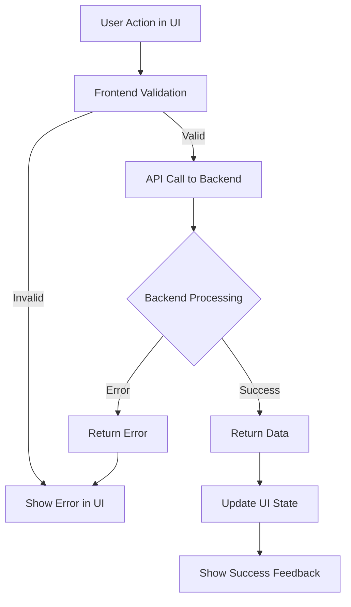

# FRD: [Feature Name] (Fullstack)

> **Feature**: [Name] | **Priority**: High/Medium/Low | **Status**: Draft/Review/Approved
> **Type**: Fullstack (Backend API + Frontend UI) | **Version**: 1.0 | **Updated**: [YYYY-MM-DD]

---

## 1. Tổng quan (Overview) [REQUIRED]

| Item | Mô tả |
|------|-------|
| **Mục đích (Purpose)** | [Business value - why this feature exists] |
| **Phạm vi (Scope)** | Bao gồm: [...] \| Không bao gồm: [...] |
| **Người dùng (Users)** | [Roles that use this feature] |
| **Dependencies** | [Features/Systems required before this] |

### Scope Breakdown

| Layer | In Scope | Out of Scope |
|-------|----------|--------------|
| **Backend** | [API endpoints, business logic] | [What backend won't handle] |
| **Frontend** | [UI screens, interactions] | [What frontend won't handle] |

---

## 2. User Stories [REQUIRED]

### US-001: [Story Title]

**As** [role], **I want** [action], **so that** [benefit].

**Acceptance Criteria**:
- [ ] AC-001: Given [context], when [action], then [result]
- [ ] AC-002: Given [context], when [action], then [result]

| Attribute | Value |
|-----------|-------|
| Priority | High/Medium/Low |
| Backend | Yes/No |
| Frontend | Yes/No |

---

## 3. Business Rules [CONDITIONAL]

> **INCLUDE IF**: Feature có business rules phức tạp (validation, calculation, workflow)
> **SKIP IF**: Simple CRUD without special rules

| ID | Rule Name | Description | Layer |
|----|-----------|-------------|-------|
| BR-001 | [Rule name] | When [condition], then [action] | Backend |
| BR-002 | [Rule name] | [Description] | Both |

---

## 4. UI Behavior Rules [CONDITIONAL]

> **INCLUDE IF**: Feature có UI interactions phức tạp
> **SKIP IF**: Simple display or no frontend component

| ID | Rule Name | Trigger | Behavior |
|----|-----------|---------|----------|
| UB-001 | [Rule name] | When user [action] | UI should [behavior] |

---

## 5. User Flow (End-to-End) [CONDITIONAL]

> **INCLUDE IF**: Multi-step user journey involving both frontend and backend
> **SKIP IF**: Single-step action

---

## 6. Non-Functional Requirements [CONDITIONAL]

> **INCLUDE IF**: Có yêu cầu đặc biệt về performance, security
> **SKIP IF**: Standard requirements apply

| ID | Category | Requirement | Layer |
|----|----------|-------------|-------|
| NFR-001 | API Performance | Response < 200ms | Backend |
| NFR-002 | UI Performance | Page load < 3s | Frontend |
| NFR-003 | Security | [Requirement] | Both |

---

## References

| Type | Path/Link |
|------|-----------|
| TDD (Fullstack) | `docs/features/[feature]/TDD-fullstack-[feature].md` |
| Test Scenarios | `docs/features/[feature]/test-scenarios.md` |
