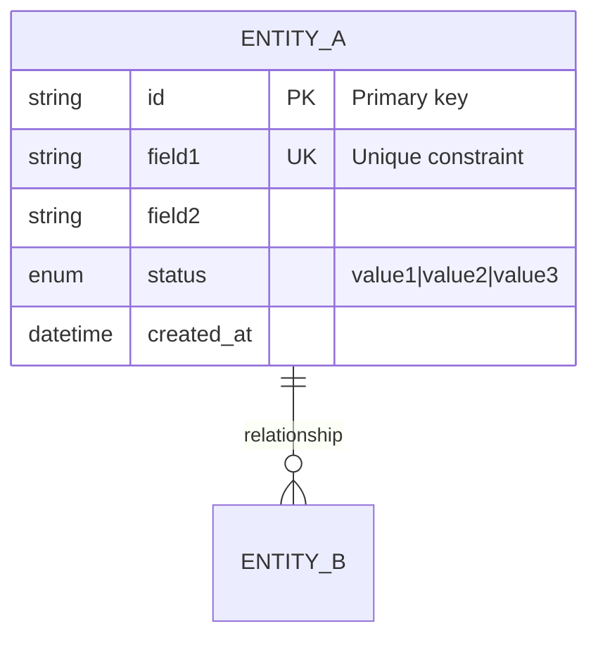
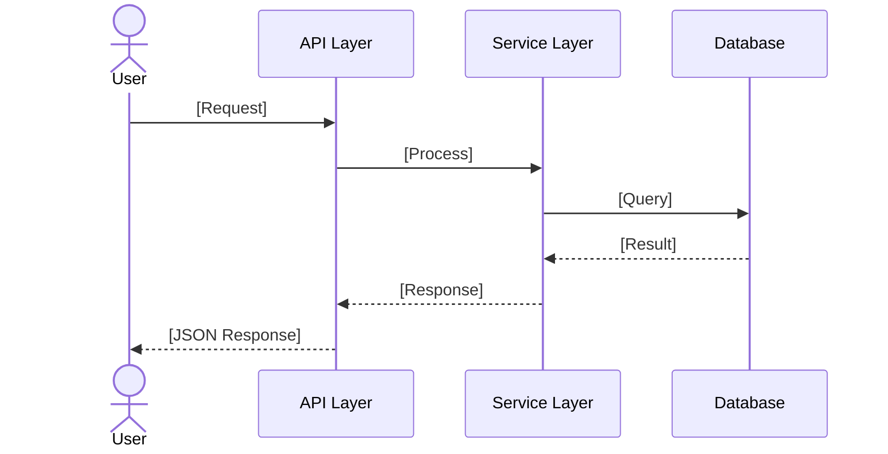

# TDD: [Feature Name]

> **Feature**: [Name] | **Complexity**: Simple/Medium/Complex
> **Version**: 1.0 | **Updated**: [YYYY-MM-DD]

## Complexity Guide

| Level | Criteria | Required Sections |
|-------|----------|-------------------|
| **Simple** | Basic CRUD, single entity, no complex logic | 1, 4, 5, 6 |
| **Medium** | Multiple entities, business logic, permissions | 1, 2, 3, 4, 5, 6, 7 |
| **Complex** | Workflows, integrations, security requirements | All (1-8) |

---

## 1. Design Overview [REQUIRED]

| Item | Description |
|------|-------------|
| **Purpose** | [Technical summary - what this implements] |
| **Actors** | [User roles, system actors] |
| **Key Decisions** | [Important architectural choices made] |

---

## 2. ERD / Data Model [CONDITIONAL]

> **INCLUDE IF**: Feature creates/modifies database tables, columns, or relations
> **SKIP IF**: UI-only feature, no database changes, or uses existing models without modification



**Entity Descriptions**:

| Entity | Description | Key Fields |
|--------|-------------|------------|
| [Entity] | [What it represents] | [Important fields] |

---

## 3. Roles & Permissions [CONDITIONAL]

> **INCLUDE IF**: Feature has role-based access control or permission logic
> **SKIP IF**: Public feature accessible to all users, or no auth required

| Role | Description | Permissions |
|------|-------------|-------------|
| admin | System administrator | All operations |
| user | Regular user | Own data CRUD |
| guest | Unauthenticated | Read public only |

**Permission Matrix**:

| Resource | admin | user | guest |
|----------|-------|------|-------|
| [Entity] | CRUD | CRU (own) | R |

**Legend**: C=Create, R=Read, U=Update, D=Delete, (own)=only own resources

---

## 4. API Design [REQUIRED]

> For frontend-only features without backend changes, describe API endpoints being consumed

### Endpoints Overview

| Method | Endpoint | Purpose | Auth | Roles |
|--------|----------|---------|------|-------|
| GET | `/api/[resource]` | List all | Yes | admin, user |
| POST | `/api/[resource]` | Create | Yes | admin |
| PUT | `/api/[resource]/:id` | Update | Yes | admin, user (own) |
| DELETE | `/api/[resource]/:id` | Delete | Yes | admin |

### Request/Response Schema (Primary Endpoint)

```json
// POST /api/[resource]
// Request Body
{
  "field1": "string (required, max: 255)",
  "field2": "number (optional, default: 0)"
}

// Response 201 Created
{
  "success": true,
  "data": {
    "id": "uuid",
    "field1": "value",
    "createdAt": "ISO8601 datetime"
  }
}

// Response 4xx/5xx Error
{
  "success": false,
  "error": {
    "code": "ERR-[FEAT]-001",
    "message": "Human readable message"
  }
}
```

---

## 5. Architecture & Flow [REQUIRED]

### Sequence Diagram (Main Flow)



---

## 6. Implementation Files [REQUIRED]

> Language-agnostic paths. Use appropriate extension for your project.

| File Path | Action | Description |
|-----------|--------|-------------|
| `src/routes/[feature].route.*` | CREATE | Route definitions |
| `src/controllers/[feature].controller.*` | CREATE | Request handlers |
| `src/services/[feature].service.*` | CREATE | Business logic |
| `src/models/[feature].model.*` | CREATE | Entity/Schema definitions |

---

## 7. Error Handling [CONDITIONAL]

> **INCLUDE IF**: Feature has custom error codes or complex error scenarios
> **SKIP IF**: Uses standard framework error handling only

| Code | Scenario | HTTP | User Message |
|------|----------|------|--------------|
| ERR-[FEAT]-001 | Validation failed | 400 | [Message] |
| ERR-[FEAT]-002 | Resource not found | 404 | [Message] |
| ERR-[FEAT]-003 | Unauthorized access | 403 | [Message] |

---

## 8. Security & Performance [CONDITIONAL]

> **INCLUDE IF**: Complex feature with security requirements or performance considerations
> **SKIP IF**: Simple/Medium complexity features

### Security

| Aspect | Implementation |
|--------|----------------|
| Authentication | [Method: JWT/Session/API Key] |
| Authorization | [RBAC/Custom permission check] |
| Input Validation | [Schema validation, sanitization] |

### Performance

| Aspect | Implementation |
|--------|----------------|
| Caching | [Strategy: Redis/Memory, TTL] |
| Database | [Indexes on frequently queried fields] |
| Pagination | [Cursor/Offset, default: 20, max: 100] |

---

## References

| Type | Path/Link |
|------|-----------|
| FRD | `docs/features/[feature]/FRD-[feature].md` |
| Test Scenarios | `docs/features/[feature]/test-scenarios.md` |
