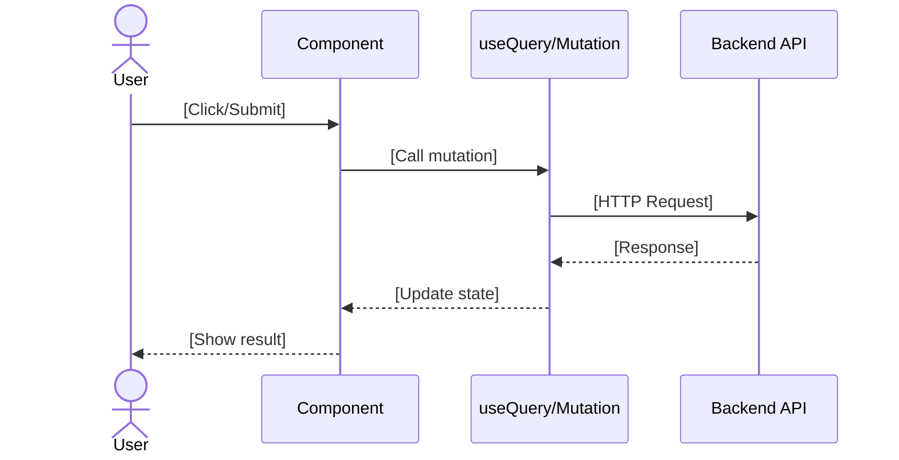

# TDD: [Feature Name] (Frontend)

> **Feature**: [Name] | **Complexity**: Simple/Medium/Complex
> **Framework**: [Next.js/Nuxt/React/Vue] | **Version**: 1.0 | **Updated**: [YYYY-MM-DD]

## Complexity Guide

| Level | Criteria | Required Sections |
|-------|----------|-------------------|
| **Simple** | Basic UI, simple state, no API calls | 1, 5, 6 |
| **Medium** | Forms, API integration, moderate state | 1, 2, 3, 4, 5, 6, 7 |
| **Complex** | Multi-step flows, complex state management | All (1-8) |

---

## 1. Design Overview [REQUIRED]

| Item | Description |
|------|-------------|
| **Purpose** | [Technical summary - what this implements] |
| **Actors** | [User roles interacting with this UI] |
| **Key Decisions** | [Important frontend architecture choices] |

**Component Tree**:
```
[PageComponent]
├── [HeaderSection]
├── [MainContent]
│   ├── [FormComponent]
│   └── [ListComponent]
└── [FooterSection]
```

---

## 2. Roles & Permissions (UI) [CONDITIONAL]

> **INCLUDE IF**: UI has role-based visibility or actions
> **SKIP IF**: Public UI accessible to all, no permission-based rendering

| Component/Action | admin | user | guest |
|------------------|-------|------|-------|
| [Create Button] | ✓ | ✓ | - |
| [Edit Action] | ✓ | ✓ (own) | - |
| [Delete Action] | ✓ | - | - |
| [Admin Settings] | ✓ | - | - |

**Legend**: ✓ = Visible, (own) = Only for own resources, `-` = Hidden

---

## 3. State Management [CONDITIONAL]

> **INCLUDE IF**: Feature has local state, global store, or server state caching
> **SKIP IF**: Stateless component or very simple state

### Local State (Component)

```typescript
const [formData, setFormData] = useState<FormData>({
  [field]: '',
});
```

### Server State (React Query/SWR)

| Query Key | Data | Stale Time |
|-----------|------|------------|
| `['[feature]']` | List data | 5 min |
| `['[feature]', id]` | Single item | 1 min |

---

## 4. API Integration [CONDITIONAL]

> **INCLUDE IF**: Feature calls backend APIs
> **SKIP IF**: Static UI, no API calls

| Method | Endpoint | Purpose | Hook |
|--------|----------|---------|------|
| GET | `/api/[path]` | Fetch list | `use[Feature]Query` |
| POST | `/api/[path]` | Create item | `use[Feature]Mutation` |
| PUT | `/api/[path]/:id` | Update item | `use[Feature]Mutation` |
| DELETE | `/api/[path]/:id` | Delete item | `use[Feature]Mutation` |

---

## 5. Architecture & Flow [REQUIRED]

### Sequence Diagram



---

## 6. Implementation Files [REQUIRED]

| File Path | Action | Description |
|-----------|--------|-------------|
| `pages/[feature].*` | CREATE | Main page/route |
| `components/[Feature]/index.*` | CREATE | Container component |
| `components/[Feature]/[Child].*` | CREATE | Child component |
| `hooks/use[Feature].*` | CREATE | Data fetching hook |
| `types/[feature].*` | CREATE | TypeScript interfaces |

---

## 7. Error Handling (UI) [CONDITIONAL]

> **INCLUDE IF**: Feature has specific error states or custom error handling
> **SKIP IF**: Uses standard framework error handling

| Scenario | UI Response | Recovery |
|----------|-------------|----------|
| API Error 4xx | Inline error message | Fix input, retry |
| API Error 5xx | Toast: "Server error" | Retry button |
| Network Error | Banner: "Offline" | Auto-retry on reconnect |

---

## 8. Security & Performance [CONDITIONAL]

> **INCLUDE IF**: Complex feature with security or performance concerns
> **SKIP IF**: Simple/Medium complexity features

### Security

| Aspect | Implementation |
|--------|----------------|
| XSS Prevention | Escape user input |
| Auth Token | HttpOnly cookie / Secure storage |
| Input Sanitization | Validate before submit |

### Performance

| Technique | Implementation |
|-----------|----------------|
| Memoization | `useMemo`, `useCallback`, `React.memo` |
| Lazy Loading | `React.lazy()`, `dynamic()` |
| Virtualization | For large lists |

---

## References

| Type | Path/Link |
|------|-----------|
| FRD (Frontend) | `docs/features/[feature]/FRD-frontend-[feature].md` |
| Test Scenarios | `docs/features/[feature]/test-scenarios.md` |
