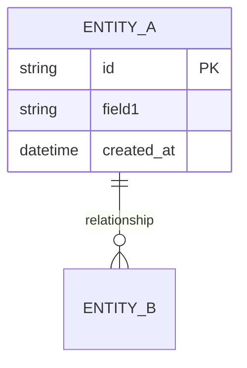
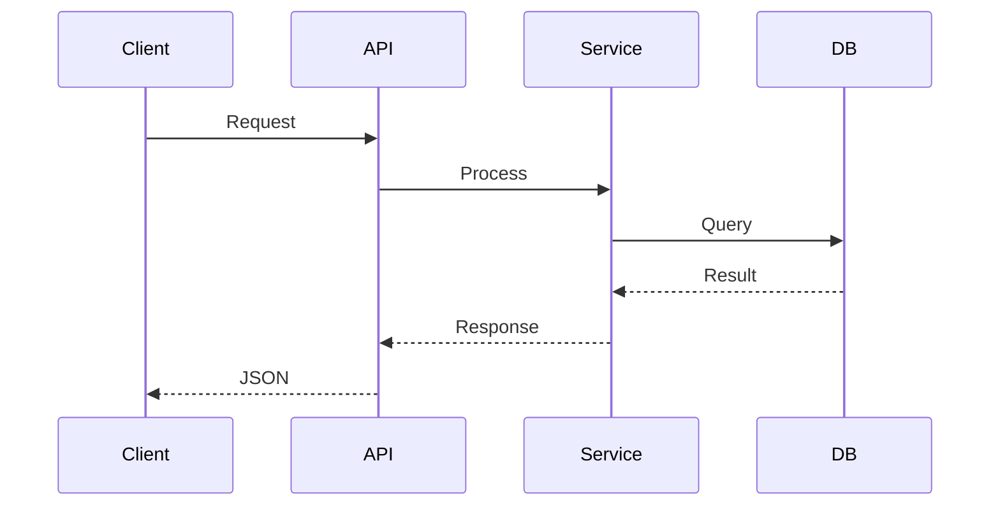
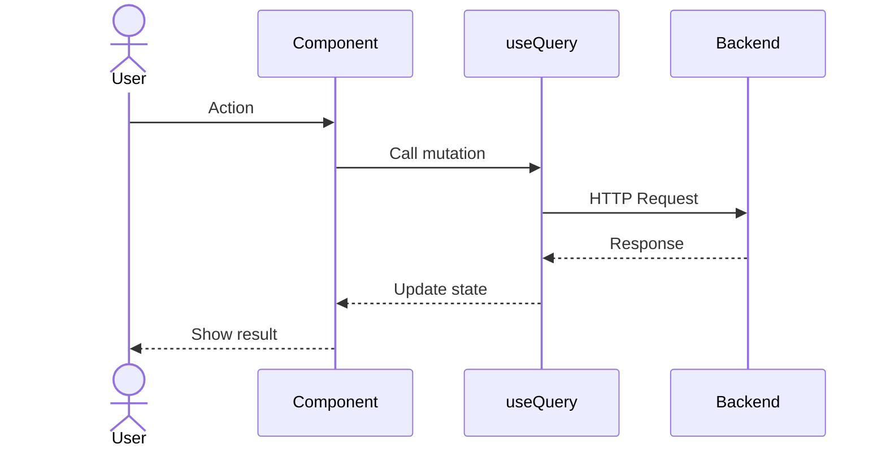
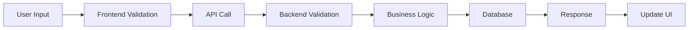

# TDD: [Feature Name] (Fullstack)

> **Feature**: [Name] | **Complexity**: Simple/Medium/Complex
> **Type**: Fullstack (Backend API + Frontend UI) | **Version**: 1.0 | **Updated**: [YYYY-MM-DD]

## Complexity Guide

| Level | Backend Sections | Frontend Sections |
|-------|------------------|-------------------|
| **Simple** | 1, 3, 4, 5 | 1, 7, 8, 9 |
| **Medium** | 1, 2, 3, 4, 5, 6 | 1, 7, 8, 9, 10 |
| **Complex** | All Backend (1-6) | All Frontend (7-11) |

---

# 🔧 BACKEND

## 1. Design Overview [REQUIRED]

| Item | Description |
|------|-------------|
| **Purpose** | [Technical summary - what this implements] |
| **Actors** | [User roles, system actors] |
| **Key Decisions** | [Important architectural choices] |

---

## 2. ERD / Data Model [CONDITIONAL]

> **INCLUDE IF**: Feature creates/modifies database tables
> **SKIP IF**: No database changes



---

## 3. API Design [REQUIRED]

| Method | Endpoint | Purpose | Auth |
|--------|----------|---------|------|
| GET | `/api/[resource]` | List all | Yes |
| POST | `/api/[resource]` | Create | Yes |
| PUT | `/api/[resource]/:id` | Update | Yes |
| DELETE | `/api/[resource]/:id` | Delete | Yes |

### Request/Response Schema

```json
// POST /api/[resource]
// Request
{ "field1": "string (required)" }

// Response 201
{ "success": true, "data": { "id": "uuid", "field1": "value" } }

// Response 4xx
{ "success": false, "error": { "code": "ERR-001", "message": "..." } }
```

---

## 4. Backend Architecture [REQUIRED]



---

## 5. Backend Implementation Files [REQUIRED]

| File Path | Action | Description |
|-----------|--------|-------------|
| `src/routes/[feature].route.*` | CREATE | Route definitions |
| `src/controllers/[feature].controller.*` | CREATE | Request handlers |
| `src/services/[feature].service.*` | CREATE | Business logic |
| `src/models/[feature].model.*` | CREATE | Entity definitions |

---

## 6. Backend Error Handling [CONDITIONAL]

> **INCLUDE IF**: Custom error codes needed
> **SKIP IF**: Standard framework errors

| Code | Scenario | HTTP |
|------|----------|------|
| ERR-[FEAT]-001 | Validation failed | 400 |
| ERR-[FEAT]-002 | Not found | 404 |

---

# 🖥️ FRONTEND

## 7. Component Tree [REQUIRED]

```
[PageComponent]
├── [HeaderSection]
├── [MainContent]
│   ├── [FormComponent]
│   └── [ListComponent]
└── [FooterSection]
```

---

## 8. State Management [CONDITIONAL]

> **INCLUDE IF**: Feature has local/global state or API caching
> **SKIP IF**: Stateless component

### Server State (API Calls)

| Query Key | Endpoint | Stale Time |
|-----------|----------|------------|
| `['[feature]']` | GET /api/[path] | 5 min |

---

## 9. Frontend Architecture [REQUIRED]



---

## 10. Frontend Implementation Files [REQUIRED]

| File Path | Action | Description |
|-----------|--------|-------------|
| `pages/[feature].*` | CREATE | Main page |
| `components/[Feature]/index.*` | CREATE | Container |
| `components/[Feature]/[Child].*` | CREATE | Child components |
| `hooks/use[Feature].*` | CREATE | Data fetching |

---

## 11. Frontend Error Handling [CONDITIONAL]

> **INCLUDE IF**: Custom error UI states
> **SKIP IF**: Standard error handling

| Scenario | UI Response |
|----------|-------------|
| API Error 4xx | Inline error message |
| API Error 5xx | Toast: "Server error" |
| Network Error | Banner: "Offline" |

---

# 🔗 INTEGRATION

## 12. End-to-End Flow [CONDITIONAL]

> **INCLUDE IF**: Complex interaction between frontend and backend
> **SKIP IF**: Simple CRUD



---

## References

| Type | Path/Link |
|------|-----------|
| FRD | `docs/features/[feature]/FRD-fullstack-[feature].md` |
| Test Scenarios | `docs/features/[feature]/test-scenarios.md` |
