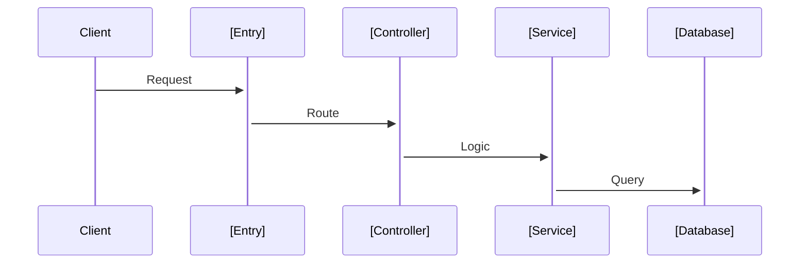

# gen-project-overview

> Tạo tài liệu tổng quan dự án cho team nhỏ. Output: `docs/README.md` + `docs/ARCHITECTURE.md`

## 🎯 Khi nào sử dụng?

| Tình huống | Sử dụng? |
|------------|----------|
| **Dự án CÓ SẴN** - Cần tạo docs tổng quan khi tiếp nhận dự án | ✅ |
| **Dự án MỚI** - Team setup xong cần document | ✅ |
| **Onboarding** - Thành viên mới cần hiểu dự án nhanh | ✅ |
| Cần tài liệu chi tiết từng feature | ❌ (Dùng `/gen-feature-doc`) |

## ✅ Requirements

- ✅ **Language**: Vietnamese (trừ code/technical terms)
- ✅ **High-level**: Chỉ thông tin quan trọng, không quá chi tiết
- ✅ **Verification**: Lấy từ source code thực tế, không giả định
- ✅ **2 files only**: `docs/README.md` + `docs/ARCHITECTURE.md`

---

## 🔄 Workflow

### Step 1: Analyze Project

**ACTIONS**:
1. **Detect Framework**: 
   - Check `composer.json` → Laravel/CakePHP
   - Check `package.json` → Next.js/Nuxt/NestJS/Express
   - Check `pubspec.yaml` → Flutter
   
2. **Identify Key Info**:
   - Main language/framework
   - Database (MySQL, PostgreSQL, etc.)
   - Cache (Redis, Valkey)
   - Cloud (AWS, Cloudflare)

3. **Scan Structure**:
   - Count directories/files
   - Identify main folders (src, app, pages, components)

---

### Step 2: Create docs/README.md

**File**: `docs/README.md`

**Template**:
```markdown
# [Project Name]

> [1-2 câu mô tả ngắn về dự án]

## 🚀 Quick Start

### Prerequisites
- Node.js v[version] / PHP v[version]
- [Database] v[version]
- [Other requirements]

### Installation
```bash
# Clone repository
git clone [url]

# Install dependencies
[command]

# Setup environment
cp .env.example .env

# Run development
[command]
```

## 📁 Project Structure

```
[project]/
├── [main-folder]/     # [description]
├── [config-folder]/   # [description]
└── [other-folder]/    # [description]
```

## 🔗 Links

- **Architecture**: [ARCHITECTURE.md](./ARCHITECTURE.md)
- **Features Documentation**: [features/](./features/)

## 👥 Team

| Role | Responsibility |
|------|----------------|
| PM | Project management |
| Leader | Technical decisions |
| Developer | Implementation |
| QC | Testing |
```

**RULES**:
- Chỉ ghi thông tin verify được từ code
- Nếu không tìm được version → ghi "Check package file"
- Quick Start phải test được locally

---

### Step 3: Create docs/ARCHITECTURE.md

**File**: `docs/ARCHITECTURE.md`

**Template**:
```markdown
# Architecture Overview

> Tài liệu kiến trúc high-level cho [Project Name]

## 🏗️ Tech Stack

### Core
| Component | Technology | Version |
|-----------|------------|---------|
| Framework | [Framework] | [version] |
| Language | [Language] | [version] |
| Database | [DB] | [version] |

### [CONDITIONAL] Infrastructure
| Service | Usage |
|---------|-------|
| [AWS/Cloudflare Service] | [Purpose] |

## 📐 Architecture Pattern

**Pattern**: [Monolithic/Modular/etc.]

```
[Simple diagram showing main layers]
```

## 📁 Key Directories

| Directory | Purpose | Key Files |
|-----------|---------|-----------|
| `[dir]` | [purpose] | [main files] |

## 🔄 Request Flow



## 🔐 Authentication

**Method**: [Session/JWT/OAuth/etc.]

[Brief description of auth flow]

## 📝 Development Notes

### Conventions
- [Naming convention]
- [Code style]

### Important Files
- `[config-file]` - [purpose]
- `[env-file]` - [purpose]
```

**RULES**:
- [CONDITIONAL] sections chỉ thêm nếu có trong code
- Diagram đơn giản, dễ hiểu
- Không liệt kê tất cả files, chỉ những files quan trọng

---

### Step 4: Completion Report

**OUTPUT**:
```
✅ Project Overview Documentation Complete

📄 Files Created:
- [✓] docs/README.md - Quick start & overview
- [✓] docs/ARCHITECTURE.md - Tech stack & architecture

📊 Summary:
- Framework: [detected]
- Database: [detected]
- Architecture: [pattern]

🔗 Next Steps:
- Review và điều chỉnh thông tin nếu cần
- Chạy `/gen-feature-doc` để tạo docs cho từng feature
```

---

## 📋 Framework-Specific Adaptations

### Laravel/CakePHP
- Main folders: `app/`, `routes/`, `database/`
- Config: `config/`, `.env`
- Architecture: MVC

### Next.js/Nuxt
- Main folders: `pages/` or `app/`, `components/`
- Config: `next.config.js` / `nuxt.config.ts`
- Architecture: Component-based

### NestJS
- Main folders: `src/modules/`, `src/common/`
- Config: `nest-cli.json`
- Architecture: Modular

### Flutter
- Main folders: `lib/`, `assets/`
- Config: `pubspec.yaml`
- Architecture: Widget-based

---

## ⚠️ Keep It Simple

**DO**:
- ✅ High-level overview
- ✅ Essential info only
- ✅ Copy-paste ready commands
- ✅ Quick to read (5-10 min)

**DON'T**:
- ❌ Detailed API documentation
- ❌ Every file listing
- ❌ Complex diagrams
- ❌ Duplicate info from code comments
