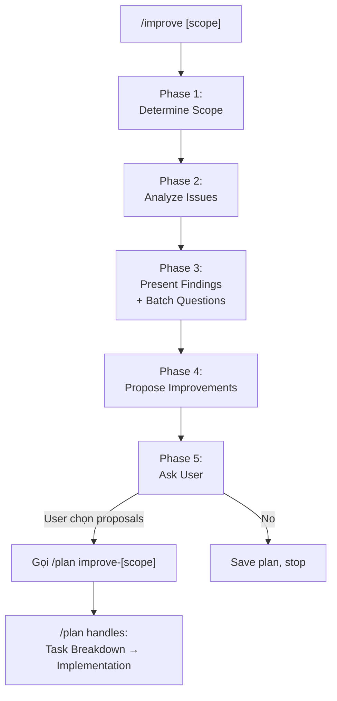

# /improve Workflow

> Analyze project (or a specific feature/area) for current issues, propose actionable improvements, and delegate to `/plan` for detailed planning & implementation.

## 🎯 When to Use?

| Scenario | Use `/improve`? | Note |
|----------|-----------------|------|
| Quick check & improve a feature | ✅ Yes | `/improve user-auth` |
| Overall project review | ✅ Yes | `/improve` (no args) |
| Deep health audit with reports | ❌ No | Use `/investigate-codebase-health` |
| Fix a specific bug | ❌ No | Use `/fix-bug` |
| Already know what to build | ❌ No | Use `/plan` or `/develop-feature` |

---

## ⚠️ Critical Rules

1. ✅ **Evidence-based** - Every issue MUST reference actual code (`file:line`). No speculation.
2. ✅ **Batch Questions** - Group all questions into one batch. Max 2 question rounds.
3. ✅ **Actionable** - Every proposal must be concrete with clear next steps.
4. ✅ **Priority-driven** - Sort improvements by impact (high → low).
5. ✅ **No direct implementation** - This workflow ONLY analyzes and suggests. Delegate to `/plan` for implementation.
6. ✅ **Vietnamese** - Documentation in Vietnamese, code/terms in English.

---

## 🔄 Workflow Flow



---

## 🔄 Workflow Phases

### Phase 1: Determine Scope

**IF `$ARGUMENTS` provided** (e.g., `/improve user-auth`):
- Scope = specific feature/area
- Search: `docs/features/`, related source files, routes, controllers, services
- Focus analysis on that area only

**IF no arguments** (e.g., `/improve`):
- Scope = entire project
- Scan: project structure, key modules, config, dependencies
- Breadth-first analysis across all areas

**OUTPUT**:
```
🔍 **Scope**: [Feature name / Entire project]
📂 **Files to analyze**: [X] files in [Y] directories
```

→ Auto-continue to Phase 2

---

### Phase 2: Analyze Current Issues

> **Purpose**: Find real issues from actual code. No guessing.

#### 2.1: Analysis Checklist

Run through these checks (skip irrelevant ones based on scope):

| Category | What to check |
|----------|---------------|
| 🏗️ **Architecture** | Separation of concerns, coupling, circular deps, God files (>500 lines) |
| 🐛 **Code Quality** | Duplication, dead code, inconsistent naming, missing error handling |
| ⚡ **Performance** | N+1 queries, missing indexes, blocking operations, no pagination |
| 🔒 **Security** | Exposed secrets, missing validation, SQL injection, XSS risks |
| 📦 **Dependencies** | Outdated packages, unused deps, security vulnerabilities |
| 🧪 **Testing** | Missing tests for critical paths, flaky tests, low coverage |
| 📖 **Documentation** | Outdated docs, missing API docs, misleading comments |

#### 2.2: Collect Issues

For each issue found, document:
```
- **Issue**: [Brief description]
- **Location**: `file:line`
- **Impact**: 🔴 High / 🟡 Medium / 🟢 Low
- **Category**: [Architecture/Quality/Performance/Security/Deps/Testing/Docs]
```

→ Auto-continue to Phase 3

---

### Phase 3: Present Findings & Batch Questions

> **Purpose**: Show user what was found and clarify priorities in one batch.

#### 3.1: Present Issue Summary

**OUTPUT**:
```
📊 **Analysis Results: [Scope]**

### Issues Found: [X] total

| # | Issue | Category | Impact | Location |
|---|-------|----------|--------|----------|
| 1 | [Issue name] | 🏗️ Architecture | 🔴 High | `file.ts:42` |
| 2 | [Issue name] | ⚡ Performance | 🟡 Medium | `file.ts:88` |
| ... | ... | ... | ... | ... |

### 📈 Summary by Impact
- 🔴 High: [X] issues
- 🟡 Medium: [Y] issues
- 🟢 Low: [Z] issues
```

#### 3.2: Batch Questions (If Needed)

**IF there are decisions or clarifications needed**, compile all into ONE batch:

```
🤔 **Cần xác nhận trước khi đề xuất cải thiện:**

📊 **Ưu tiên:**
1. Bạn muốn tập trung cải thiện lĩnh vực nào?
   - A: Tất cả issues theo impact ← Recommended
   - B: Chỉ [category 1]
   - C: Chỉ [category 2]

🔧 **Phạm vi:**
2. Mức độ thay đổi chấp nhận được?
   - A: Quick fixes only (< 30 min each)
   - B: Medium effort OK (< 1 day each) ← Recommended
   - C: Major refactoring OK (multi-day)

⚙️ **Chi tiết:**
3. [Any specific question about the codebase/feature]

Reply: "1A, 2B" hoặc mô tả chi tiết.
```

**IF no questions needed** → Auto-continue to Phase 4

**WAIT** for user response (max 2 rounds of questions)

---

### Phase 4: Propose Improvements

> **Purpose**: Create concrete improvement proposals sorted by priority.

#### 4.1: Generate Proposals

**OUTPUT**:
```
### 🔧 Improvement Proposals

#### 🔴 High Priority

**IMP-1: [Title]**
- **Issue**: [What's wrong + `file:line`]
- **Proposal**: [What to do]
- **Effort**: Quick fix / Medium / Major

**IMP-2: [Title]**
- ...

#### 🟡 Medium Priority

**IMP-3: [Title]**
- ...

#### 🟢 Low Priority (Nice to Have)

**IMP-4: [Title]**
- ...
```

→ Auto-continue to Phase 5

---

### Phase 5: Ask User & Delegate to /plan

> **MANDATORY**: Always ask user which improvements to pursue.

#### 5.1: Ask User to Select

**OUTPUT**:
```
📋 Đã phân tích xong! Tóm tắt:

� Issues found: [X] total
� Improvements proposed: [Y] total
   - 🔴 High: [A] items
   - 🟡 Medium: [B] items
   - 🟢 Low: [C] items

� Bạn muốn tạo plan cho improvement nào?
   - [A] All — tạo plan cho tất cả
   - [H] High only — chỉ high priority
   - [S] Select — chọn cụ thể (nhập số: "1, 3, 5")
   - [N] No — chỉ lưu kết quả, không tạo plan

Reply: "A", "H", "S 1,3,5", hoặc "N"
```

**WAIT** for user response.

#### 5.2: Save Analysis Report

Regardless of user's choice, save the analysis:
1. `mkdir -p docs/plans`
2. Create `docs/plans/improve-[scope].md` with all findings and proposals

#### 5.3: Delegate to /plan

**IF user selected improvements (A/H/S)**:

1. Compile selected improvements into a plan description
2. Output to user:
```
📋 Tạo plan cho [X] improvement(s)...

→ Chuyển sang /plan improve-[scope] để lên kế hoạch chi tiết.
```

3. **IMMEDIATELY read and execute** the `/plan` workflow:
   - Read the workflow file at `.jai1/workflow/plan.md`
   - Execute it **as if the user typed** `/plan improve-[scope]`
   - Pass the selected improvement proposals as the **Requirements input** for Phase 1
   - Pass the improvement details from analysis as the **Design input** for Phase 2
   - The `/plan` workflow will then handle: Task Breakdown → Ask User → Implementation

> ⚠️ **DO NOT** save selection as "Pending" or stop here. You MUST continue by reading `.jai1/workflow/plan.md` and executing that workflow immediately.

**IF user chose N**:
```
✅ Analysis saved: docs/plans/improve-[scope].md

Khi muốn implement, chạy:
  /plan improve-[scope]
```

---

## 📋 Examples

### Example 1: Improve a specific feature
```
User: /improve user-authentication

Phase 1: Scope = user-authentication (12 files)
Phase 2: Found 5 issues (2 high, 2 medium, 1 low)
Phase 3: Present findings → batch questions

🤔 Cần xác nhận:
1. Focus? A: Tất cả ← Recommended
2. Effort? A: Quick fixes / B: Medium ← Recommended

User: "1A, 2B"

Phase 4: 5 improvement proposals
Phase 5: Ask user

� Bạn muốn tạo plan cho improvement nào?

User: "H" (high only)

→ Chuyển sang /plan improve-user-authentication
→ /plan handles: Task Breakdown → Implementation
```

### Example 2: Full project review, selective improvements
```
User: /improve

Phase 1: Scope = entire project
Phase 2: Found 12 issues across modules
Phase 3: Present findings → no questions needed
Phase 4: 12 proposals sorted by priority
Phase 5: Ask user

User: "S 1,3,7" (select specific ones)

→ Chuyển sang /plan improve-project với 3 selected proposals
→ /plan handles the rest
```

### Example 3: Analysis only, no implementation
```
User: /improve payment-gateway

Phase 1-4: Analyze and propose
Phase 5:

User: "N"

✅ Analysis saved: docs/plans/improve-payment-gateway.md
   Resume later: /plan improve-payment-gateway
```

---

## ✅ Quality Checklist

- [ ] Scope correctly determined (feature or full project)
- [ ] All issues backed by code evidence (`file:line`)
- [ ] Issues sorted by impact (High → Medium → Low)
- [ ] Batch questions used (max 2 rounds)
- [ ] Improvement proposals are concrete and actionable
- [ ] Analysis saved to `docs/plans/improve-[scope].md`
- [ ] User confirmed which improvements to pursue
- [ ] Delegated to `/plan` for selected improvements (if any)
